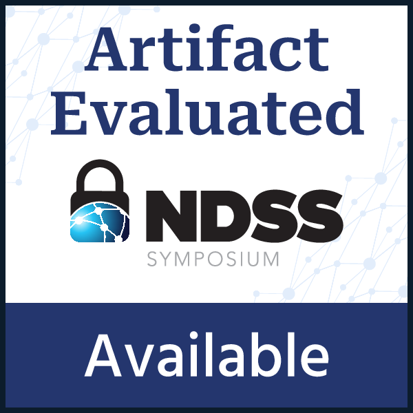

[![DOI](https://img.shields.io/badge/doi-10.6084/m9.figshare.30000817.v1-blue.svg?style=flat&labelColor=whitesmoke&logo=data%3Aimage%2Fpng%3Bbase64%2CiVBORw0KGgoAAAANSUhEUgAAAB8AAAAfCAYAAAAfrhY5AAAJsklEQVR42qWXd1DTaRrHf%2BiB2Hdt5zhrAUKz4IKEYu9IGiGFFJJQ0gkJCAKiWFDWBRdFhCQUF3UVdeVcRQEBxUI3yY9iEnQHb3bdW1fPubnyz%2F11M7lvEHfOQee2ZOYzPyDv%2B3yf9%2Fk95YX4fx%2BltfUt08GcFEuPR4U9hDDZ%2FVngIlhb%2FSiI6InkTgLzgDcgfvtnovhH4BzoVlrbwr55QnhCtBW4QHXnFrZbPBaQoBh4%2FSYH2EnpBEtqcDMVzB93wA%2F8AFwa23XFGcc8CkT3mxz%2BfXWtq9T9IQlLIXYEuHojudb%2BCM7Hgdq8ydi%2FAHiBXyY%2BLjwFlAEnS6Jnar%2FvnQVhvdzasad0eKvWZKe8hvDB2ofLZ%2FZEcWsh%2BhyIuyO5Bxs2iZIE4nRv7NWAb0EO8AC%2FWPxjYAWuOEX2MSXZVgPxzmRL3xKz3ScGpx6p6QnOx4mDIFqO0w6Q4fEhO5IzwxlSwyD2FYHzwAW%2BAZ4fEsf74gCumykwNHskLM7taQxLYjjIyy8MUtraGhTWdkfhkFJqtvuVl%2F9l2ZquDfEyrH8B0W06nnpH3JtIyRGpH1iJ6SfxDIHjRXHJmdQjLpfHeN54gnfFx4W9QRnovx%2FN20aXZeTD2J84hn3%2BqoF2Tqr14VqTPUCIcP%2B5%2Fly4qC%2BUL3sYxSvNj1NwsVYPsWdMUfomsdkYm3Tj0nbV0N1wRKwFe1MgKACDIBdMAhPE%2FwicwNWxll8Ag40w%2BFfhibJkGHmutjYeQ8gVlaN%2BjO51nDysa9TwNUFMqaGbKdRJZFfOJSp6mkRKsv0rRIpEVWjAvyFkxNOEpwvcAVPfEe%2Bl8ojeNTx3nXLBcWRrYGxSRjDEk0VlpxYrbe1ZmaQ5xuT0u3r%2B2qe5j0J5uytiZPGsRL2Jm32AldpxPUNJ3jmmsN4x62z1cXrbedXBQf2yvIFCeZrtyicZZG2U2nrrBJzYorI2EXLrvTfCSB43s41PKEvbZDEfQby6L4JTj%2FfIwam%2B4%2BwucBu%2BDgNK05Nle1rSt9HvR%2FKPC4U6LTfvUIaip1mjIa8fPzykii23h2eanT57zQ7fsyYH5QjywwlooAUcAdOh5QumgTHx6aAO7%2FL52eaQNEShrxfhL6albEDmfhGflrsT4tps8gTHNOJbeDeBlt0WJWDHSgxs6cW6lQqyg1FpD5ZVDfhn1HYFF1y4Eiaqa18pQf3zzYMBhcanlBjYfgWNayAf%2FASOgklu8bmgD7hADrk4cRlOL7NSOewEcbqSmaivT33QuFdHXj5sdvjlN5yMDrAECmdgDWG2L8P%2BAKLs9ZLZ7dJda%2BB4Xl84t7QvnKfvpXJv9obz2KgK8dXyqISyV0sXGZ0U47hOA%2FAiigbEMECJxC9aoKp86re5O5prxOlHkcksutSQJzxZRlPZmrOKhsQBF5zEZKybUC0vVjG8PqOnhOq46qyDTDnj5gZBriWCk4DvXrudQnXQmnXblebhAC2cCB6zIbM4PYgGl0elPSgIf3iFEA21aLdHYLHUQuVkpgi02SxFdrG862Y8ymYGMvXDzUmiX8DS5vKZyZlGmsSgQqfLub5RyLNS4zfDiZc9Edzh%2FtCE%2BX8j9k%2FqWB071rcZyMImne1SLkL4GRw4UPHMV3jjwEYpPG5uW5fAEot0aTSJnsGAwHJi2nvF1Y5OIqWziVCQd5NT7t6Q8guOSpgS%2Fa1dSRn8JGGaCD3BPXDyQRG4Bqhu8XrgAp0yy8DMSvvyVXDgJcJTcr1wQ2BvFKf65jqhvmxXUuDpGBlRvV36XvGjQzLi8KAKT2lYOnmxQPGorURSV0NhyTIuIyqOmKTMhQ%2BieEsgOgpc4KBbfDM4B3SIgFljvfHF6cef7qpyLBXAiQcXvg5l3Iunp%2FWv4dH6qFziO%2BL9PbrimQ9RY6MQphEfGUpOmma7KkGzuS8sPUFnCtIYcKCaI9EXo4HlQLgGrBjbiK5EqMj2AKWt9QWcIFMtnVvQVDQV9lXJJqdPVtUQpbh6gCI2Ov1nvZts7yYdsnvRgxiWFOtNJcOMVLn1vgptVi6qrNiFOfEjHCDB3J%2BHDLqUB77YgQGwX%2Fb1eYna3hGKdlqJKIyiE4nSbV8VFgxmxR4b5mVkkeUhMgs5YTi4ja2XZ009xJRHdkfwMi%2BfocaancuO7h%2FMlcLOa0V%2FSw6Dq47CumRQAKhgbOP8t%2BMTjuxjJGhXCY6XpmDDFqWlVYbQ1aDJ5Cptdw4oLbf3Ck%2BdWkVP0LpH7s9XLPXI%2FQX8ws%2Bj2In63IcRvOOo%2BTTjiN%2BlssfRsanW%2B3REVKoavBOAPTXABW4AL7e4NygHdpAKBscmlDh9Jysp4wxbnUNna3L3xBvyE1jyrGIkUHaqQMuxhHElV6oj1picvgL1QEuS5PyZTEaivqh5vUCKJqOuIgPFGESns8kyFk7%2FDxyima3cYxi%2FYOQCj%2F%2B9Ms2Ll%2Bhn4FmKnl7JkGXQGDKDAz9rUGL1TIlBpuJr9Be2JjK6qPzyDg495UxXYF7JY1qKimw9jWjF0iV6DRIqE%2B%2FeWG0J2ofmZTk0mLYVd4GLiFCOoKR0Cg727tWq981InYynvCuKW43aXgEjofVbxIqrm0VL76zlH3gQzWP3R3Bv9oXxclrlO7VVtgBRpSP4hMFWJ8BrUSBCJXC07l40X4jWuvtc42ofNCxtlX2JH6bdeojXgTh5TxOBKEyY5wvBE%2BACh8BtOPNPkApjoxi5h%2B%2FFMQQNpWvZaMH7MKFu5Ax8HoCQdmGkJrtnOiLHwD3uS5y8%2F2xTSDrE%2F4PT1yqtt6vGe8ldMBVMEPd6KwqiYECHDlfbvzphcWP%2BJiZuL5swoWQYlS%2Br7Yu5mNUiGD2retxBi9fl6RDGn4Ti9B1oyYy%2BMP5G87D%2FCpRlvdnuy0PY6RC8BzTA40NXqckQ9TaOUDywkYsudxJzPgyDoAWn%2BB6nEFbaVxxC6UXjJiuDkW9TWq7uRBOJocky9iMfUhGpv%2FdQuVVIuGjYqACbXf8aa%2BPeYNIHZsM7l4s5gAQuUAzRUoT51hnH3EWofXf2vkD5HJJ33vwE%2FaEWp36GHr6GpMaH4AAPuqM5eabH%2FhfG9zcCz4nN6cPinuAw6IHwtvyB%2FdO1toZciBaPh25U0ducR2PI3Zl7mokyLWKkSnEDOg1x5fCsJE9EKhH7HwFNhWMGMS7%2BqxyYsbHHRUDUH4I%2FAheQY7wujJNnFUH4KdCju83riuQeHU9WEqNzjsJFuF%2FdTDAZ%2FK7%2F1WaAU%2BAWymT59pVMT4g2AxcwNa0XEBDdBDpAPvgDIH73R25teeuAF5ime2Ul0OUIiG4GpSAEJeYW9wDTf43wfwHgHLKJoPznkwAAAABJRU5ErkJggg%3D%3D)](https://doi.org/10.6084/m9.figshare.30000817.v1) &nbsp;&nbsp;&nbsp;&nbsp; 

# Introduction

Source IP address spoofing facilitates various malicious attacks, and Outbound Source Address Validation (OSAV) remains the best current practice for preventing spoofed packets from exiting a network. Accurately measuring OSAV deployment is essential for investigating the Internet’s vulnerability to IP spoofing. However, such measurements typically require sending spoofed packets from within the tested network, necessitating cooperation from network operators.

OSAVRoute is the first non-cooperative system capable of capturing the fine-grained characteristics of OSAV deployment. Unlike existing non-cooperative methods that can only identify the **presence** and **absence** of OSAV, OSAVRoute identifies both the **presence** and **absence** of OSAV and further measures its **blocking granularity** and **blocking depth**, achieving capabilities previously limited to cooperative methods. OSAVRoute accomplishes this by explicitly tracing the forwarding paths of spoofed packets, enabling identification of their generation and propagation behavior.

# Compilation
OSAVRoute with DNS can be compiled with
```bash
cd osavroute_dns && go build -o osavroute_dns
```
OSAVRoute with TCP can be compiled with
```bash
cd osavroute_tcp && go build -o osavroute_tcp
```
OSAVRoute requires Go 1.22 or later.

# Usage

## Stateless scanning
For stateless scanning, the common usage is
```bash
osavroute_dns -o <OUTPUT_DIR> -pps <PACKET_PER_SECOND> -nsend <N_SENDERS> -domain <DOMAIN>
```
- `OUTPUT_DIR` specifies the path to store output files. When scanning is finished, there will be three directories in `OUTPUT_DIR`:

   - `OUTPUT_DIR/dns` stores response messages except ICMP Time-Exceeds messages received. Each line in each file is `<ORG_ADDR>,<RESP_ADDR>,<RESP_TYPE>`. `<ORG_ADDR>` is the destination address of the initial probing packet. `<RESP_ADDR>` is the responding address. `<RESP_TYPE>` is the protocol type of the response.

   - `OUTPUT_DIR/icmp` stores intermediate files and is usually unimportant.

   - `OUTPUT_DIR/icmp-re` stores ICMP Time-Exceeds messages received. Each line in each file is `<ORG_ADDR>,<FD_ADDR>,<RESP_ADDR>,<TTL>`. `<FD_ADDR>` is the destination address when the probing packet's TTL decreases to 0. `<TTL>` is the TTL of the initial probing packet.

- `<PACKET_PER_SECOND>` is the user-defined sending rate. 
- `<N_SENDERS>` is the number of goroutines used for sending packets. Larger `<PACKET_PER_SECOND>` requires larger `<N_SENDERS>`.

- `<DOMAIN>` is the domain used for stateless scanning.

To use OSAVRoute with TCP, execute the following command:
```bash
osavroute_tcp -o <OUTPUT_DIR> -r <REMOTE_PORT> -pps <PACKET_PER_SECOND> -nsend <N_SENDERS>
```
The output format is similar to `osavroute_dns`; however, `osavroute_tcp` stores response messages in the `OUTPUT_DIR/tcp` directory rather than `OUTPUT_DIR/dns`. Furthermore, you must specify the target TCP port using the `-r <REMOTE_PORT>` option.

## Early-filtering scanning
For early-filtering scanning, the common usage is

```bash
osavroute_dns -mode=early -i <INPUT_FILE> -d <DNS_OUT_FILE> -o <ICMP_OUT_FILE> -domain <DOMAIN> -rand <RAND_PFX>
```
In this command,
- `<INPUT_FILE>` specifies the input file containing addresses you want to scan. This file is formatted by one address on each line.
- `<DNS_OUT_FILE>` specifies the path to store DNS responses and is formatted as 
   > `<ORG_ADDR>,<RESP_ADDR>,<TTL>` 

   on each line.
- `<ICMP_OUT_FILE>` specifies the path to store ICMP Time-Exceeds messages and is formatted as 
   > `<ORG_ADDR>,<RESP_ADDR>,<TTL>`

   on each line.
- `<DOMAIN>` is the domain used for scanning.
- `<RAND_PFX>` is a prefix string added to the query domain to distinguish between different scans.

On the ADNS side, you can receive DNS queries of domains in the following format:
> \<RAND_PFX\>.\<TTL\>.\<IP_HEX\>.\<IS_NORMAL\>.\<DOMAIN\>

- `<RAND_PFX>` is the random prefix specified by the user in the command.
- `<TTL>` is the Time-To-Live value of the probing packet that triggers this DNS query.
- `<IP_HEX>` is the probed IP address in the hex format.
- `<IS_NORMAL>` indicates the type of packet that triggered the DNS query:
    - `1` is triggered by a normal packet.
    - `0` is triggered by a spoofed packet.
- `<DOMAIN>` is the he domain specified by the user in the command.

## Blocking granularity scanning
For blocking granularity scanning, the common usage is

```bash
osavroute_dns -mode=gran -i <INPUT_FILE> -domain <DOMAIN> -rand <RAND_PFX>
```
In this command,

- `<INPUT_FILE>` specifies the input file containing addresses you want to scan. This file is formatted by one address on each line. 
- `<DOMAIN>` is the domain used for scanning.

ADNS receives DNS queries for domains in the following format:

> \<RAND_PFX\>.\<GRAN\>.\<IP_HEX\>.4.\<DOMAIN\>

- `<RAND_PFX>` is the random prefix specified by the user in the command.
- `<GRAN>` is the blocking granularity tested by the probing packet that triggers the DNS query.
- `<IP_HEX>` is the probed IP address in hexadecimal format.
- `4` indicates that the DNS query is triggered by a blocking granularity scan.
- `<DOMAIN>` is the domain specified by the user in the command.

# Note
1. OSAVRoute can automatically find your network interface and destination MAC address (MAC address of your gateway). However, you can always specify them by:
   ```bash
   osavroute_dns -o <OUTPUT_DIR> -pps <PACKET_PER_SECOND> -nsend <N_SENDERS> -iface <NETWORK_INTERFACE> -dmac <DEST_MAC>
   ```
2. You **SHOULD** own the domain used for stateless scanning, unless doing so would be unethical, as the scanning will draw DNS traffic to the owner's ADNS.
3. You **MUST** own the domain used for early-filtering scanning and blocking granularity scanning. The ADNS must also be configured to receive DNS queries. The configuration of the ADNS is not specified here.
4. Early-filtering and blocking granularity scanning is based on DNS, and OSAVRoute with TCP cannot run them.
5. For more details, you can run
   ```bash
   osavroute_dns -h
   ```
   or
   ```bash
   osavroute_tcp -h
   ```

# License
This artifact is licensed under the [MIT License](LICENSE.txt).

# Cite this paper

```
@inproceedings{wang2025osavroute,
  title={{OSAVRoute: Advancing Outbound Source Address Validation Deployment Detection with Non-Cooperative Measurement}},
  author={Wang, Shuai and Li, Ruifeng and Chen, Li and Li, Dan and Qin, Lancheng and Cao, Qian},
  booktitle={The Network and Distributed System Security (NDSS) Symposium 2026},
  address={San Diego, CA, USA},
  year={2026}
}
```